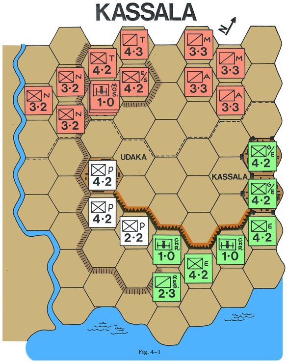

# _Kassala_

This repo contains the assets of a game "module" for [Vassal Engine](https://vassalengine.org/). You'll need Vassal Engine to use the module (i.e. to play the game).

The game is from [_The Complete Book of Wargames_ (1980)](https://www.google.com/books/edition/The_Complete_Book_of_Wargames/5giXGAAACAAJ?hl=en), Chapter 4.

It's a decent bit of fun and holds a special place in at least some folks' hearts, including my own. I was nine years old, and it was the very first wargame I ever learned and played to completion. I photocopied the thing, cut out the components, glued them onto some heavy cardstock from my older brother's comic book sleeve materials, similarly crafted a separate turn track, and had myself a pretty good time!

In decreasing order of ease and/or rectitude, there are three ways to get the module:

1. Download it from the [Vassal module catalog](https://vassalengine.org/wiki/Category:Modules).
2. Download it from this repo's [Releases](https://github.com/rummelsworth/vassal-module-kassala/releases).
3. Build it with this repo (see "Development" below).

The game's rules can be accessed via the Help menu in the Vassal user interface after the module is opened.

Enjoy!

## Design notes

- The unit colors are based _roughly_ on the contemporaneous flag colors of the combatant forces, referenced [via Wikipedia][eaw].
- The terrain colors are based _roughly_ on current satellite imagery of the area around [Kassala, Sudan](https://en.wikipedia.org/wiki/Kassala).
- The color design is, overall, minimal! Just a little spice to avoid bare black-and-white...

## Links of interest

- [Ethiopian-Adal War - Wikipedia][eaw]
- [Kassala | Board Game | BoardGameGeek](https://boardgamegeek.com/boardgame/14235/kassala)
- ["What happened where in 1541?" - History Stack Exchange](https://history.stackexchange.com/q/60529/27652)

[eaw]: https://en.wikipedia.org/wiki/Ethiopian%E2%80%93Adal_War

## Development

First and foremost, if you want to hack on this module (or do any Vassal module authoring at all), learn you some [Vassal Wiki](https://vassalengine.org/wiki/Main_Page) for great good!

This repo's "vmod" folder contains all the assets for this Vassal module. There are two helper scripts, one for building the module file from the "vmod" folder and one for "unbuilding" it, i.e. recreating the "vmod" folder from the module file. So, if you update the module file, you should "unbuild" it into the repo.

PowerShell Core v7.2.1 or later is strongly recommended if you want to use the "build" script. (I think v7.0.0 or later might be okay, but I've only tested down to v7.2.1.) PowerShell and early versions of PowerShell Core can produce incorrect zip archives that cannot be read on/by some systems, including Vassal Engine.
