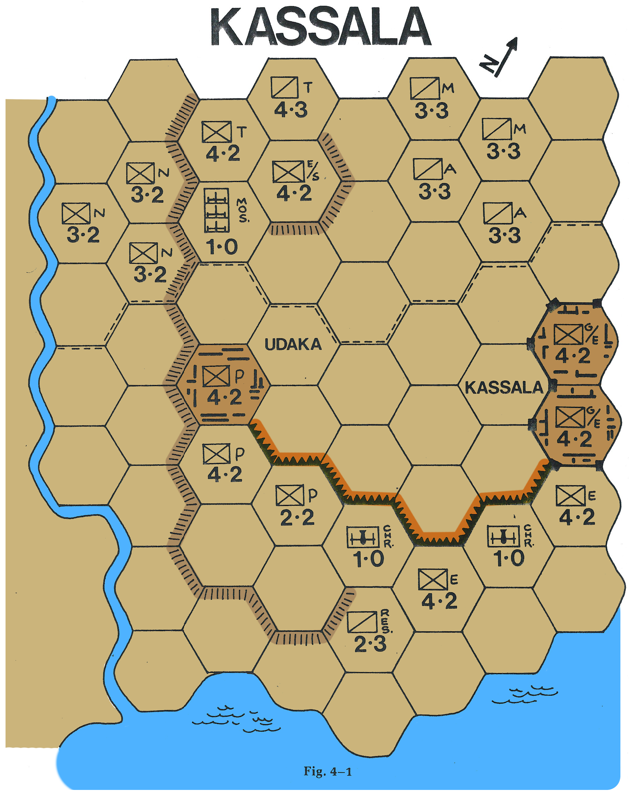

> [*The Complete Book of Wargames* (1980)][tcbw], Chapter 4.

[tcbw]: https://www.google.com/books/edition/The_Complete_Book_of_Wargames/5giXGAAACAAJ

---

# *Kassala:* An Introductory Wargame

It's all very well to read about wargames, to have the common terms and procedures defined and explained, but there's no substitute for seeing and playing one.
Hence, *Kassala*.

*Kassala* is a simulation&mdash;a re-creation of an actual, if obscure, sixteenth-century battle that took place between Moslem and Christian soldiers in northeastern Africa.
The playing pieces represent the forces&mdash;infantry, cavalry, and artillery&mdash;believed to have been there.
The wargame board is a modified map of the site of the battle.

This game is a short, enjoyable, and challenging contest for two people.
The "Moslem" player must attack and try to take the towns of Kassala and Udaka before the game's ten-turn time limit runs out.
The "Christian" player must try to prevent this.
Although the luck of the die can be a factor, victory will tend to go to the person who outplans and outmaneuvers his opponent.

Finally, *Kassala* is an introduction to contemporary wargames.
Wargaming fanatics who disdain anything less elaborate than *War in the East* may not recognize *Kassala* as belonging to the same genre.
It isn't, admittedly, a highly refined version of the German invasion of Russia in World War II or Napoleon's defeat at Waterloo.
But you'll find all the basic wargaming elements discussed in the previous chapter: a mapboard divided into hexagonal spaces, cardboard playing pieces with printed combat and movement factors, different unit types, zones of control, terrain effects, a Combat Results Table for resolving battles, and so on.
To be sure, *Kassala* has fewer pieces&mdash;and fewer kinds of pieces&mdash;than chess and takes less time to play&mdash;twenty minutes or so, with a bit of practice&mdash;and the rules have been written specifically to make them easy to understand, none of which is true of the games discussed in the rest of this book.
And, once you have mastered the basic game, you can use some of the optional rules that have been provided to add further complexity to *Kassala*.
After that, you'll be ready for *War at Sea*, *Stalingrad*, *Richthofen's War*, Metagaming's MicroGames, Series 120 games from Game Designers' Workshop, and Simulations Publications' folio and capsule games.
Moving up to really complex games like *Squad Leader*, *Terrible Swift Sword*, or&mdash;if you must&mdash;even *Drang Nach Osten!* just takes practice and a little effort.

## HISTORICAL BACKGROUND TO THE GAME

In 1527 the first Protuguese embassy to the Coptic Christian kingdom of Ethiopia concluded its visit and sailed for home.
Not long thereafter, Imam Ahmed ibn Ibrahim el Ghazi, called Ahmed Gran (the left-handed), led a mixed force of fanatic Moslem warriors on a religious jihad into Ethiopia.
Due primarily to the presence within their ranks of two hundered Turkish infrantrymen armed with matchlocks, the invading Moslems had little trouble crushing native resistance.
Ethiopian Emperor Lebna Dengel scarcely had time to send a plea for aid to Portugal before fleeing to the highlands in the northwestern portion of the kingdom.

For more than a decade the Moslem occupation continued.
As the Moslems spread from their homelands on the eastern coast of Africa throughout the kingdom, the Ethiopians were pressed farther back into the highlands.
During this period Lebna Dengel died and, in 1540, was succeeded on the throne by his son Claudius, who became Emperor Galawdewos.

In 1541, Portuguese soldiers, armed with muskets and led by Christopher da Gama (son of the explorer Vasco da Gama), slipped into the port of Massawa.
Marching to aid the emperor, the Portuguese survived some minor skirmishes against small Moslem bands but were finally attacked en masse by the bulk of the Imam's forces.
The Moslem army killed nearly half the Europeans, including Da Gama, but suffered heavy losses.
While the Moslems regrouped, the remaining Portuguese hurried to join the Christian forces.

At the walled desert town of Kassala on the river Gash, in what is now Sudan, the forces of Emperor Galawdewos are believed to have made their climactic stand.
Reinforced by the veteran Portuguese musketeers and armed from a secret cache of weapons hidden earlier, the Christians prepared their defenses.
With reinforcements of their own in the form of troops from the Moslem Ottoman Empire, the army of Ahmed Gran camped less than half a mile away.

At dawn, the Moslem banners were raised; their cannon spouted thunder and lightning, and the assault began.
When the clouds of battle finally cleared, the battered Christians had weathered the storm.
Most of the Imam's infantry lay dead or dying, and the surviving Moslem forces withdrew to the safety of Khartoum, about two hundred fifty miles to the west.

For two years following the battle, the emperor recruited troops.
Then, with a force of eight thousand infantry and five hundred cavalry, he attacked the Moslems at Waina Rega.
After sixteen years in Ethiopia, Ahmed Gran fell to a Christian musket ball.
Although Emperor Galawdewos died two years later in a minor engagement, he had turned the Moslem tide for good at Kassala.

## *Kassala:* Rules of Play

<ol type="I">
<li>
    Components
    <ol type="A">
    <li>
The mapboard (Fig. 4&ndash;1) depicts the area surrounding the town of Kassala, the scene of a crucial battle in 1541 between the Christian Ethiopians of Emperor Galawdewos and the invading Moslem army of Imam Ahmed Gran.
The terrain has been altered to conform to the strictures of map size.
The mapboard has been divided into hexagonal spaces&mdash;hexes&mdash;to regulate movement and combat.
Each hex represents approximately one hundred yards from side to side, and each turn in the game corresponds very roughly to thirty minutes of real time.

<b>Fig. 4&ndash;1</b>

        <ol>
        <li>
There are two types of special hexes that affect play.
            <ol type="a">
            <li>
Kassala Hexes
            </li>
            <li>
Udaka Hex
            </li>
            </ol>
        </li>
        <li>
There are two types of special hex-sides that affect play.
            <ol type="a">
            <li>
Wadi Hex-sides
            </li>
            <li>
Trench/Abatis Hex-sides
            </li>
            </ol>
        </li>
        <li>
The effects of these terrain features are fully explained in the rules for <a href="#movement">Movement (II.D)</a> and <a href="#combat">Combat (II.E)</a>, and are summarized in the Terrain Effects Key.
        </li>
        </ol>
    </li>
    <li>
The playing pieces or units are cardboard tiles, often called "counters," which represent the groups of soldiers involved in the conflict.
There are two sets of pieces, one for each player.
The pieces are listed with their historical equivalents.
The number to the left of each unit indicates the total number of each piece.
The composition of forces is included for information purposes only; it is not involved in the play of the game.
        <ol>
        <li>
The Moslem player's units consist of:

(Fig. 4&ndash;2) Approximately 300 Marmaluke warriors armed primarily with lances and bows.

(Fig. 4&ndash;3) Approximately 200 Arab cavalry armed with assorted weapons.
        </li>
        <li>
The Christian player's units consist of:
        </li>
        <li>
        </li>
        <li>
        </li>
        <li>
        </li>
        <li>
        </li>
        </ol>
    </li>
    <li>
    </li>
    <li id="movement">
    </li>
    <li id="combat">
    </li>
    </ol>
</li>
<li>
    How to Play the Game
    <ol type="A">
    <li>
    </li>
    <li>
    </li>
    <li>
    </li>
    <li>
    </li>
    <li>
    </li>
    </ol>
</li>
<li>
    Winning the Game
    <ol type="A">
    <li>
    </li>
    <li>
    </li>
    </ol>
</li>
<li>
    Optional Rules
    <ol type="A">
    <li>
    </li>
    <li>
    </li>
    <li>
    </li>
    </ol>
</li>
<li>
    Examples of Play
    <ol type="A">
    <li>
    </li>
    <li>
    </li>
    <li>
    </li>
    <li>
    </li>
    </ol>
</li>
</ol>
